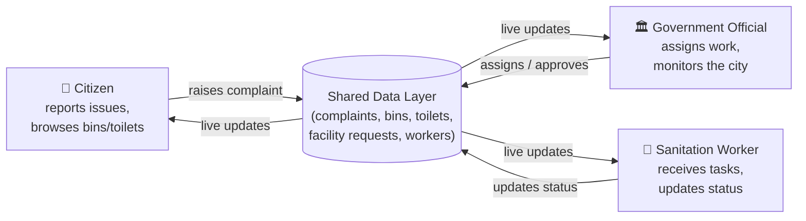
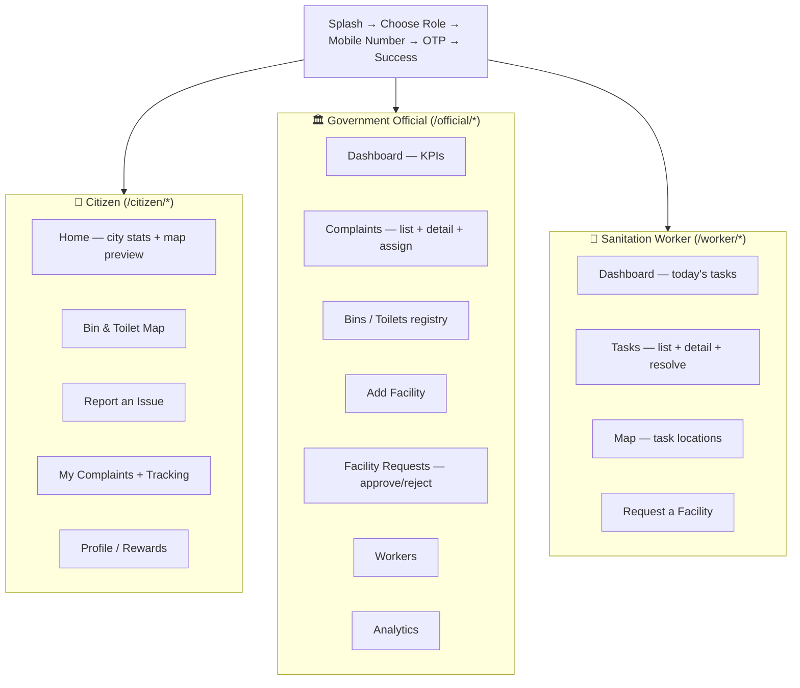
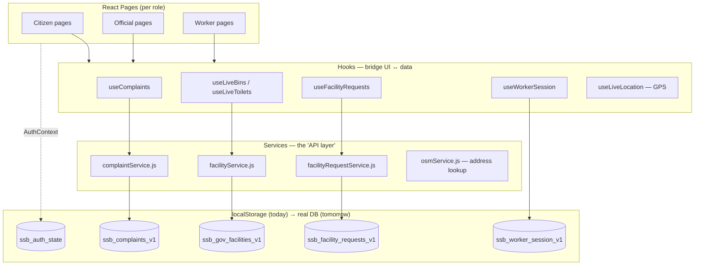
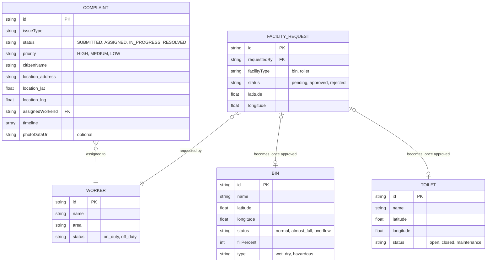
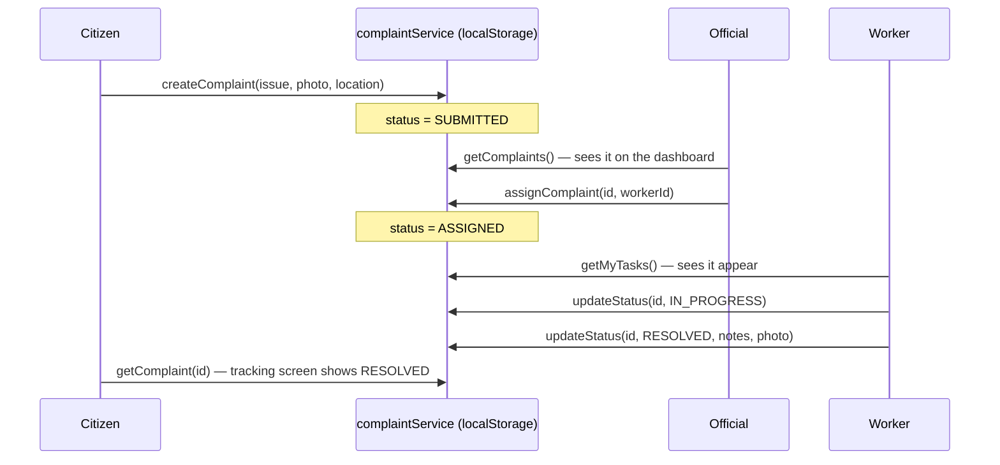
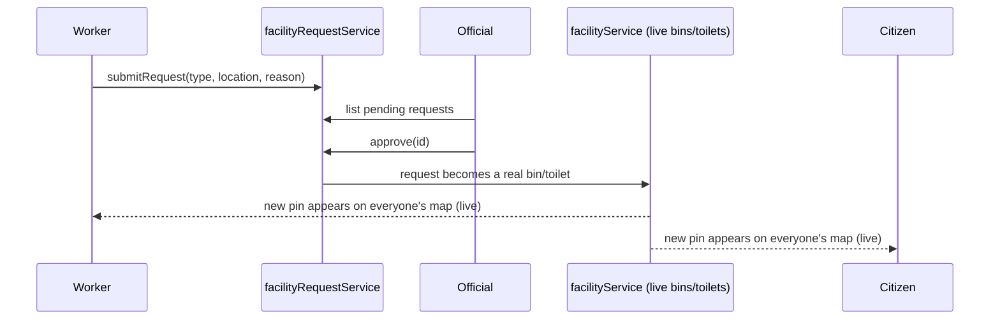
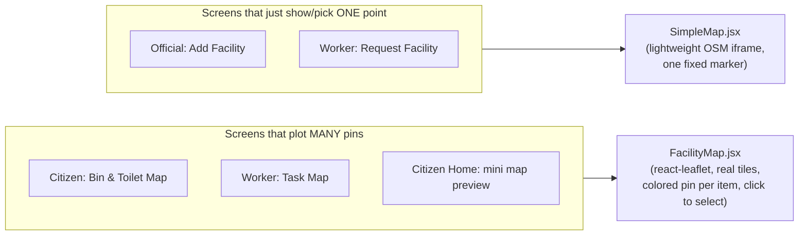

# Smart Swachh Bharat — System Design

*A multi-role civic sanitation web app for citizens, government officials, and sanitation workers.*

---

## 1. What the system does, in one paragraph

A **citizen** reports a dirty bin or spots a nearby toilet on a live map. A **government official** sees that complaint land on a dashboard, assigns it to a **worker**, and tracks it until it's resolved. The worker gets it as a task on their phone, updates its status as they clean it up, and can also request that a new bin or toilet be installed somewhere. Every role sees the same underlying data — complaints, bins, toilets, workers — just through a different lens. That's the whole system.



---

## 2. Tech stack (and why)

| Layer | Choice | Why |
|---|---|---|
| UI framework | **React 19** + **Vite** | Fast dev server, component-based UI, easy to reason about per-role screens |
| Styling | **Tailwind CSS** | Utility classes keep three very different UIs (citizen/official/worker) visually consistent without a custom design-system build |
| Routing | **react-router-dom** | Client-side, role-guarded routes (`/citizen/*`, `/official/*`, `/worker/*`) |
| Maps | **react-leaflet** (Leaflet.js) over free OpenStreetMap tiles | No API key required, supports multiple custom colored pins — needed for showing many bins/toilets/tasks at once |
| Data persistence | **`localStorage`**, wrapped in small "service" modules | Zero backend needed for a prototype/demo, but the wrapper is written so a real API can be swapped in later without touching any screen |
| Cross-tab sync | Native browser **`storage` event** + an in-app pub/sub | So if the official approves a facility request in one tab, a worker's tab updates too |

This is intentionally a **frontend-only prototype**: there is no server. Every "backend" concept (a complaints table, a bins table, etc.) is simulated by a JavaScript module that reads/writes `localStorage` but exposes the same shape of functions a real API client would (`getComplaints()`, `createComplaint()`, `updateComplaint()`...). This is the single most important design decision in the project — see §7.

---

## 3. The three roles and what each one can do



Access is enforced by a single guard component, `RequireRole`, wrapped around every route in `App.jsx`. It checks `AuthContext` (which role the person logged in as) and redirects to `/login` if it doesn't match — so a worker can never open `/official/...` by typing the URL.

---

## 4. High-level architecture



**Why this shape matters:** no page ever calls `localStorage` directly. Every page calls a *hook* (e.g. `useComplaints()`), every hook calls a *service* (e.g. `complaintService.getComplaints()`), and only the service touches storage. That one rule is what makes §7 (moving to a real backend) a small, contained change instead of a rewrite.

---

## 5. Core data models

These are the four "tables" the whole app is built on. In the code they live in `src/data/*.js` (shape + seed data) and are read/written through `src/services/*.js`.



**Key idea — a complaint's `status` is a small state machine**, and the same four states drive the citizen's tracking screen, the official's dashboard, and the worker's task list:

```
SUBMITTED → ASSIGNED → IN_PROGRESS → RESOLVED
```

Every role reads this exact same field; they just render it differently (a progress timeline for the citizen, a KPI count for the official, a task card for the worker).

---

## 6. How data flows across the three roles (the important part)

### 6a. A complaint's life



### 6b. A facility request's life (worker asks for a new bin/toilet)



### How "live" actually works without a server

Each service keeps a small in-memory list of subscriber callbacks (`subscribe(fn)`). Whenever it writes to `localStorage`, it also calls every subscriber. Hooks like `useLiveBins()` subscribe on mount and re-render their component whenever that fires — so two components in the *same tab* update instantly. For *different tabs* (e.g. a worker's phone and an official's laptop, in a demo both open in the same browser), the native browser `storage` event fires automatically whenever another tab writes to the same `localStorage` key, and each service listens for that too. There's also an 8-second safety-net poll as a fallback. This is a deliberate low-tech substitute for what a real product would do with WebSockets/Server-Sent Events.

---

## 7. Data persistence today vs. tomorrow

This is the most important design choice, so it's worth spelling out directly.

| | Today (this build) | Tomorrow (production) |
|---|---|---|
| Where data lives | Browser `localStorage`, per-device | A real database (e.g. Postgres) behind an API |
| How pages get data | `useComplaints()` hook → `complaintService.js` | Same hook, same service — internals swapped for `fetch()` calls |
| Real-time updates | Pub/sub + `storage` event + polling | WebSockets or SSE |
| Auth | A fake OTP flow, role stored in `localStorage` | Real OTP/SMS provider + signed session tokens |
| Photo uploads | Stored as base64 strings inline | Stored in object storage (S3-style), only a URL kept in the record |

Because every screen already talks to a **service module**, not storage directly, this migration touches roughly 5 files (`complaintService.js`, `facilityService.js`, `facilityRequestService.js`, `AuthContext.jsx`, `useWorkerSession.js`) and zero page components.

---

## 8. The map subsystem (recently redesigned)

Maps appear in three places: the citizen's **Bin & Toilet Map**, the worker's **Task Map**, and single-point pickers (official "Add Facility", worker "Request Facility").



Two components exist on purpose, because they solve two different problems:

- **`FacilityMap.jsx`** — a real Leaflet map. Every bin, toilet, or task is its own colored pin (green/orange/red by status), tapping a pin selects it and the matching list item highlights (and vice versa), and the selected pin pulses.
- **`SimpleMap.jsx`** — a plain embedded map for screens that only ever need to preview or pick a *single* location, where a full interactive map would be overkill.

*(This split exists because an earlier version accidentally used the single-point iframe everywhere, including the multi-pin screens — which meant only one bin/toilet was ever visible on the map at a time. That's since been fixed.)*

---

## 9. Screen-to-role routing map

| Prefix | Role required | Screens |
|---|---|---|
| `/`, `/login`, `/mobile`, `/otp`, `/success` | none (auth flow) | Splash, Choose Role, Mobile Number, OTP, Success |
| `/citizen/*` | `citizen` | Home, Map, Bin Details, Toilet Details, Report Issue, My Complaints, Complaint Tracking, Profile |
| `/official/*` | `official` | Dashboard, Complaints (list + detail), Bins, Toilets, Add Facility, Facility Requests, Workers, Analytics, Notifications, Profile |
| `/worker/*` | `worker` | Dashboard, Tasks (list + detail), Map, Notifications, Profile, Request Facility, Facility Requests (list + detail) |

All role-restricted routes are wrapped in `<RequireRole role="...">`, which reads the logged-in role from `AuthContext` and bounces unauthorized visitors back to `/login`.

---

## 10. Component structure per role

Each role has one **"shell"** component that provides the persistent chrome (nav, header) around whatever page is active — this keeps navigation consistent without repeating layout code in every page:

- **`CitizenShell`** — bottom tab bar (Home · Map · Report · Rewards · Profile), phone-frame styled.
- **`GovShell`** — persistent left sidebar with 8 sections, desktop-dashboard styled.
- **`WorkerShell`** — bottom tab bar (Home · Tasks · Map · Profile), phone-frame styled.

Shared, role-agnostic pieces (`StatusBadge`, `PriorityBadge`, `StatusFilterTabs`, `FacilityMap`, `SimpleMap`, `BinCard`, `ToiletCard`, `OtpInput`, etc.) live directly in `src/components/` and get reused across all three shells so a "resolved" badge looks and behaves the same everywhere.

---

## 11. Non-functional design notes

- **Offline-friendly by accident:** since there's no network call for data (only for map tiles), the app keeps working if the connection drops — a nice side effect of the localStorage design, not something to rely on once a real backend exists.
- **No secrets in the client:** there's nothing to leak (no API keys — OpenStreetMap tiles and geocoding are free/keyless), which keeps the current architecture safe to deploy publicly as-is.
- **Resilience:** every storage read is wrapped in try/catch with a seed-data fallback, so a corrupted or blocked `localStorage` (e.g. private browsing) degrades gracefully instead of crashing the app.
- **Statelessness of the UI layer:** because all shared state lives in services (not component state), any screen can be reloaded directly (deep link) and will reconstruct correctly from storage.

## 12. Known limitations of the current design (by design, for a prototype)

- Data is per-browser, not per-account — clearing site data resets everything.
- "Real-time" is polling + events, not a true push channel — fine for a handful of demo users, not for scale.
- No real authentication/authorization beyond a role flag in `localStorage` — do not deploy as-is for real citizen data.
- Photos are stored as base64 inside the complaint record itself, which will hit `localStorage`'s ~5–10MB ceiling with heavy use — the first thing to move to real object storage.

---

### One-paragraph summary for someone in a hurry

Three React front-ends (citizen/official/worker) share one small set of JavaScript "service" modules that currently persist to `localStorage` but are already shaped like a real API client, so swapping in a real backend later is a contained change. Complaints move through a four-state lifecycle that every role reads the same way. Maps use a real Leaflet map wherever many pins need to show at once, and a lightweight embed wherever only one location matters. Cross-screen "live" updates are done with a pub/sub pattern plus the browser's native cross-tab storage event, standing in for what would be WebSockets in production.
